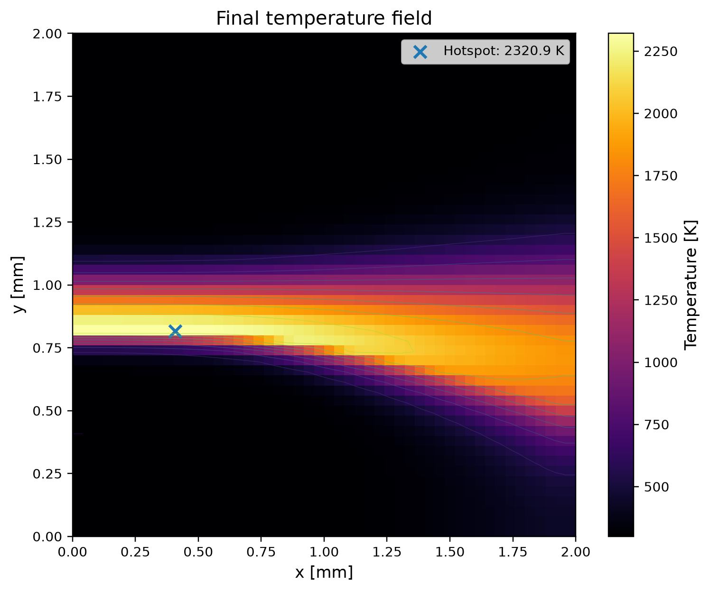
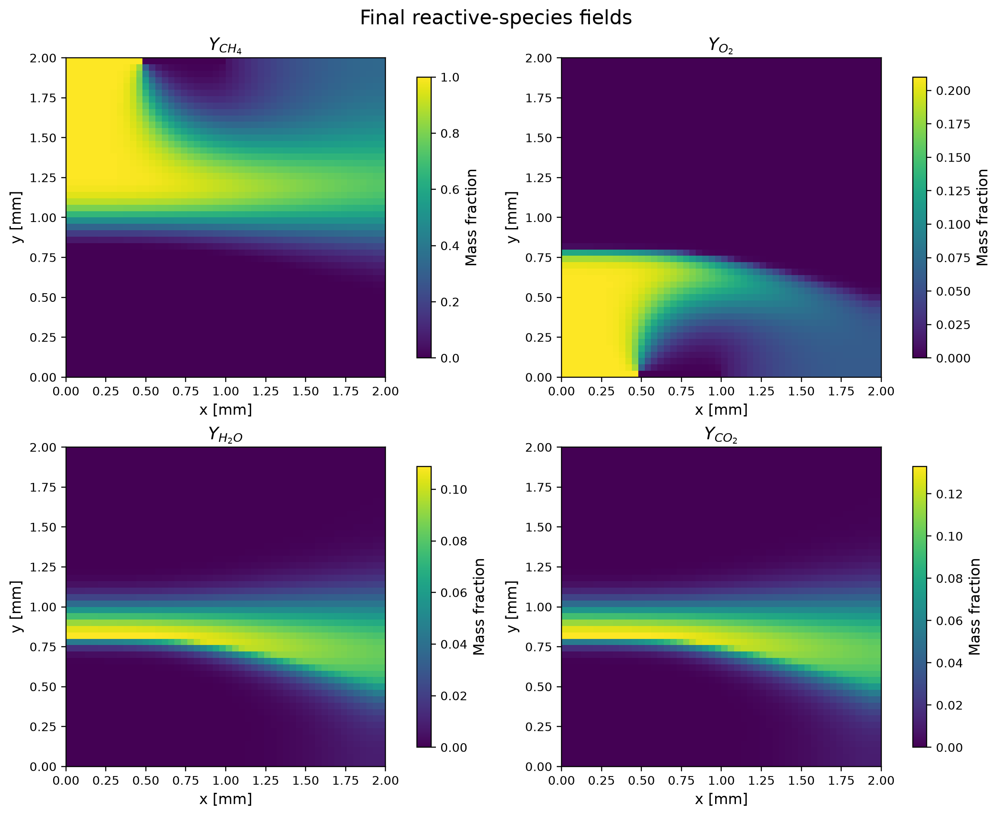
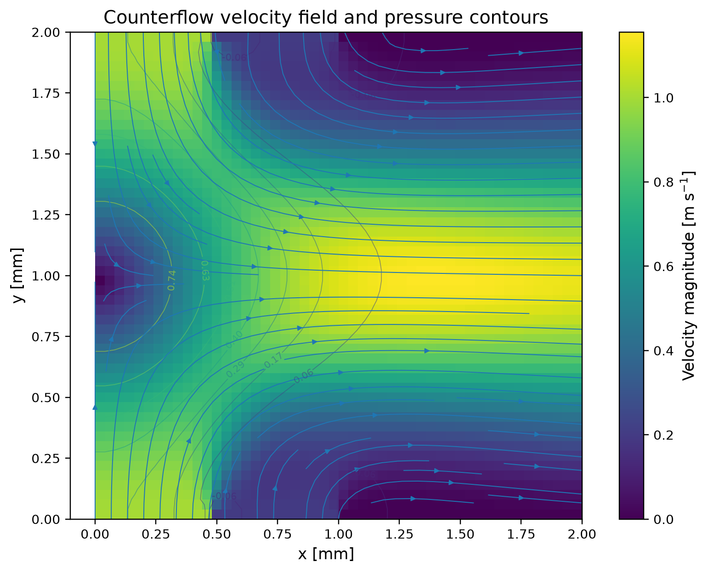
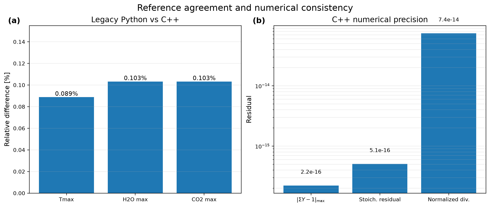
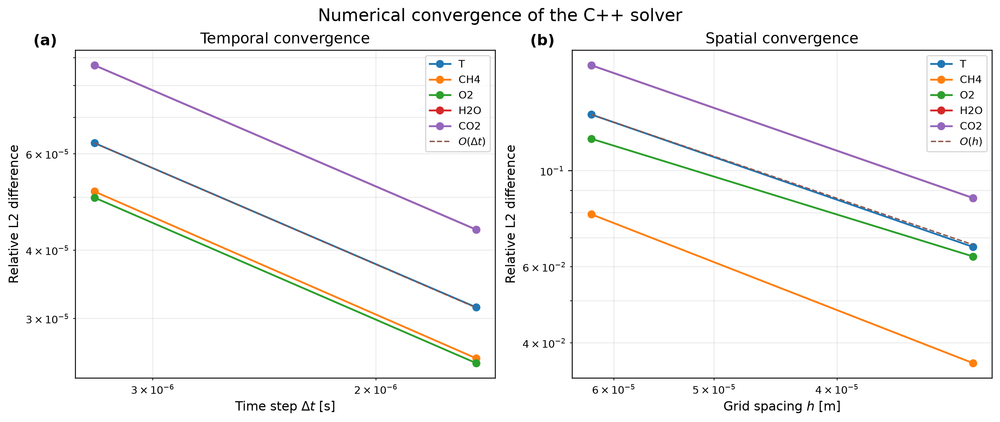
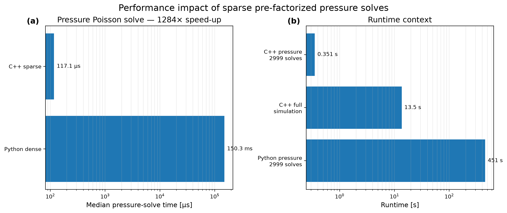

# Counterflow Combustion C++

This repository is a modern C++20 reimplementation and numerical reinterpretation of a Master's project on two-dimensional methane counterflow combustion. The original Python prototype has been redesigned into a modular scientific-computing project featuring sparse linear algebra, a compatible pressure-projection method, reactive advection-diffusion transport, adaptive chemistry subcycling, systematic verification, and reproducible performance benchmarks.

---

## Final Reactive Flow

<p align="center">
  
</p>

For the standard `50 × 50` reference configuration, the final C++ simulation reaches:

$$ T_{\max}^{C++} = 2320.95\ \mathrm{K}$$

compared with the original Python reference:

$$T_{\max}^{Python} = 2323.01\ \mathrm{K}$$

corresponding to a relative difference of only:

$$\varepsilon_{T_{\max}} = \frac{ \left| T_{\max}^{C++} - T_{\max}^{Python} \right|}{T_{\max}^{Python}} = 8.88\times10^{-4} $$

or approximately 0.089 \%

---

## Highlights 

* Modern C++20 implementation
* CMake build system
* Eigen*sparse linear algebra
* Sparse pre-factorized pressure Poisson solver
* Compatible discrete pressure projection
* Explicit advection-diffusion transport
* Simplified methane oxidation chemistry
* Adaptive chemical subcycling
* Exact mixture mass-fraction closure
* Physical counterflow inlet and open lateral outlet
* Reference and automatic thermal-activation modes
* Unit and integration testing
* Temporal convergence study
* Spatial convergence study
* Boundary-flux convergence analysis
* Numerical invariant validation
* Reproducible C++ / Python performance benchmarks
* Automated GitHub Actions CI

---

## Physical Model

The project considers a simplified two-dimensional methane counterflow configuration. Methane enters from the upper boundary while oxidizer enters from the lower boundary. The opposed streams interact in the domain and form a reacting region. The final reactive-species distributions are shown below.

<p align="center">
  
</p>

The transported reactive species are:

* methane: `CH4`
* oxygen: `O2`
* water: `H2O`
* carbon dioxide: `CO2`

Nitrogen is reconstructed from the mixture constraint.

---

## Governing Equations

### Incompressible Flow

The hydrodynamic model is based on the incompressible Navier-Stokes equations.

Mass conservation:

$$ \nabla \cdot \mathbf{u} = 0 $$

Momentum conservation:

$$ \frac{\partial \mathbf{u}}{\partial t} + (\mathbf{u}\cdot\nabla)\mathbf{u} = -\frac{1}{\rho}\nabla p + \nu\nabla^2\mathbf{u} $$

where:

* $\mathbf{u}=(u,v)$ is the velocity field,
* $p$ is pressure,
* $\rho$ is density,
* $\nu$ is the kinematic viscosity.

---

### Reactive Species Transport

Each reactive mass fraction satisfies an advection-diffusion-reaction equation:

$$ \frac{\partial Y_k}{\partial t} + \mathbf{u}\cdot\nabla Y_k = D\nabla^2Y_k + \frac{\dot{\omega}_k}{\rho} $$

where:

* $Y_k$ is the mass fraction of species $k$,
* $D$ is the species diffusivity,
* $\dot{\omega}_k$ is the chemical mass source term.

The C++ implementation explicitly transports:

$$ Y_{CH_4}, \quad Y_{O_2}, \quad Y_{H_2O}, \quad Y_{CO_2} $$

Nitrogen is reconstructed through exact mixture closure:

$$ Y_{N_2} = 1 - Y_{CH_4} - Y_{O_2} - Y_{H_2O} - Y_{CO_2} $$

which enforces:

$$ \sum_k Y_k = 1 $$

up to machine precision.

---

## Temperature Transport

The temperature field follows an advection-diffusion equation coupled to the heat released by combustion:

$$ \frac{\partial T}{\partial t} + \mathbf{u}\cdot\nabla T = D\nabla^2T + \frac{\dot{q}}{\rho c_p} $$

where:

* $T$ is temperature,
* $c_p$ is the specific heat capacity,
* $\dot{q}$ is the chemical heat-release rate.

---

## Chemistry

The model uses a simplified single-step methane oxidation reaction:

$$ CH_4 + 2O_2 \rightarrow CO_2 + 2H_2O $$

The reaction rate follows an Arrhenius-type expression:

$$ \mathcal{R} = A \left[CH_4\right] \left[O_2\right]^2 \exp\left( -\frac{T_a}{T} \right) $$

with:

$$ A = 1.1\times10^8 $$

and:

$$ T_a = 10\,000\ \mathrm{K} $$

The species source terms follow directly from the reaction stoichiometry. The corresponding mass-source conservation condition is:

$$ \sum_k \dot{\omega}_k = 0 $$

The numerical implementation preserves the expected product mass ratio:

$$ \frac{Y_{H_2O}}{Y_{CO_2}} = \frac{2M_{H_2O}}{M_{CO_2}} $$

with:

$$ \frac{2M_{H_2O}}{M_{CO_2}} = 0.81863636 $$

---

## Pressure Projection

The solver uses a fractional-step projection method. First, an intermediate velocity is computed:

$$ \mathbf{u}^* = \mathbf{u}^n + \Delta t \left[-(\mathbf{u}^n\cdot\nabla)\mathbf{u}^n + \nu\nabla^2\mathbf{u}^n \right] $$

The pressure is then obtained from:

$$ \nabla^2 p^{n+1} = \frac{\rho}{\Delta t} \nabla\cdot\mathbf{u}^* $$

Finally:

$$ \mathbf{u}^{n+1} = \mathbf{u}^* - \frac{\Delta t}{\rho} \nabla p^{n+1} $$

The C++ implementation uses compatible discrete divergence and gradient operators such that their composition reproduces the standard five-point Laplacian. This gives a normalized discrete divergence of:

$$ 7.43\times10^{-14} $$

for the final reference simulation.

---

## Flow Field

<p align="center">
  
</p>

The final formulation uses:

* a slip-type boundary on the left,
* an open outlet on the right,
* prescribed counterflow injection on the top and bottom boundaries.

The geometric boundary-flux imbalance decreases approximately as O(h) under grid refinement, while the flux balance associated directly with the discrete projection operator remains at machine precision.

---

## Numerical Architecture

The solver is organized into separate components for:

* grid and field storage,
* boundary conditions,
* Navier-Stokes integration,
* pressure Poisson solution,
* scalar transport,
* combustion chemistry,
* reactive transport,
* global simulation orchestration,
* CSV output,
* validation,
* convergence analysis,
* performance benchmarking.

Two-dimensional fields are stored as contiguous one-dimensional arrays. For a field of size $N_x\times N_y$, the mapping is:

$$ k(i,j) = i+jN_x $$

This provides contiguous memory storage while retaining convenient two-dimensional indexing through the `Field2D` interface. Memory ownership is handled through standard C++ RAII containers such as `std::vector`, avoiding manual allocation and deallocation.

---

## Sparse Pressure Solver

The original Python implementation uses a dense pressure matrix. For the standard grid N_x=N_y=50 the pressure system contains N=2500 unknowns.

A dense matrix therefore contains:

$$ N^2 = 6\,250\,000 $$

entries. The Python matrix occupies approximately: $47.7\ \mathrm{MiB}$. The C++ implementation instead uses an Eigen sparse matrix containing only $11\,862 $ non-zero entries. The matrix structure and factorization are computed once and reused during time integration.

---

## Python Prototype vs C++ Reinterpretation

This repository is not a line-by-line translation of the original Python project.

The Python implementation provided the physical problem and reference calculation, while the C++ version deliberately corrects and modernizes several numerical aspects.

Major changes include:

* dense $\rightarrow$ sparse pressure linear algebra,
* repeated factorization $\rightarrow$ reusable sparse factorization,
* compatible pressure projection,
* explicit advection of reactive species,
* physically complete inlet compositions,
* exact mass-fraction closure,
* corrected open lateral outlet,
* adaptive chemical subcycling,
* modular C++ architecture,
* systematic unit and convergence testing.

Because the discrete models differ, the C++ and Python fields are not expected to match point-by-point.

The comparison is therefore based on:

1. physical invariants,
2. numerical convergence,
3. characteristic global quantities,
4. consistency with the original combustion regime.

---

## Validation

<p align="center">
  
</p>

For the standard reference simulation:

| Quantity                        |     Result |
| ------------------------------- | ---------: |
| Maximum mixture-closure error   | `2.22e-16` |
| Maximum stoichiometric residual | `5.07e-16` |
| Normalized RMS divergence       | `7.43e-14` |
| Maximum advective CFL           |  `9.61e-2` |
| 2-D diffusion number            |  `6.00e-2` |

---

### Legacy Python Reference

| Quantity        |      Python |         C++ | Relative difference |
| --------------- | ----------: | ----------: | ------------------: |
| $T_{\max}$      | `2323.01 K` | `2320.95 K` |          `0.0888 %` |
| $Y_{H_2O,\max}$ | `0.1090003` | `0.1088878` |           `0.103 %` |
| $Y_{CO_2,\max}$ | `0.1331486` | `0.1330111` |           `0.103 %` |

The maximum-temperature difference is:

$$\varepsilon_{T_{\max}} = 0.0888\% $$

---

## Temporal Convergence

The time step is successively halved while keeping the same physical thermal-activation time. The tested time resolutions are:

$$ N_t = 3000, \quad 5999, \quad 11997$$

corresponding to:

$$ \Delta t, \quad \frac{\Delta t}{2}, \quad \frac{\Delta t}{4} $$

The observed convergence orders are:

| Field      | Observed order |
| ---------- | -------------: |
| $T$        |        `0.998` |
| $Y_{CH_4}$ |        `1.013` |
| $Y_{O_2}$  |        `1.004` |
| $Y_{H_2O}$ |        `0.998` |
| $Y_{CO_2}$ |        `0.998` |
| $T_{\max}$ |        `0.988` |

The solver therefore exhibits approximately:

$$O(\Delta t)$$ temporal convergence.

The Richardson estimate for the zero-time-step limit is:

$$ T_{\max}(\Delta t\rightarrow0) \approx 2320.936\ \mathrm{K} $$

---

## Spatial Convergence

Nested grids are used:

$$ 33\times33, \quad 65\times65, \quad 129\times129 $$

corresponding to:

$$ h, \quad \frac{h}{2}, \quad \frac{h}{4} $$

Because the grids are nested, fine-grid solutions can be restricted directly to coarse-grid coordinates without interpolation.

The observed full-field convergence orders are:

| Field      | Observed order |
| ---------- | -------------: |
| $u$        |        `1.063` |
| $v$        |        `1.134` |
| $p$        |        `0.774` |
| $T$        |        `1.009` |
| $Y_{CH_4}$ |        `1.135` |
| $Y_{O_2}$  |        `0.870` |
| $Y_{H_2O}$ |        `1.009` |
| $Y_{CO_2}$ |        `1.009` |

The dominant behavior is therefore approximately O(h) for the coupled solution.

<p align="center">
  
</p>

---

## Boundary-Flux Convergence

The physical boundary-flux imbalance decreases under grid refinement:

| Grid        | Relative imbalance |
| ----------- | -----------------: |
| `33 × 33`   |           `2.03 %` |
| `65 × 65`   |           `1.09 %` |
| `129 × 129` |          `0.575 %` |

with observed convergence orders close to $p\approx0.9$. Meanwhile, the flux balance associated with the actual discrete divergence operator remains approximately $10^{-16}$, showing machine-precision conservation for the discrete projection.

---

## Performance

<p align="center">
  
</p>

All benchmark values reported below were measured in Release mode on the same local machine.

---

### End-to-End C++ Simulation

For the standard `50 × 50`, 2999-step simulation:

$$ t_{\mathrm{C++}} = 13.55\ \mathrm{s} $$ 

median runtime over seven measured runs.

---

## Pressure Poisson Benchmark

### Legacy Python

Median dense solve:

$$ t_{\mathrm{Python}} = 150.321\ \mathrm{ms} $$

Estimated cost for 2999 pressure solves:

$$ 450.8\ \mathrm{s} $$

or approximately:

$$ 7.5\ \mathrm{min} $$

---

### C++ / Eigen Sparse

Median solve with reused sparse factorization:

$$ t_{\mathrm{C++}} = 117.075\ \mu\mathrm{s} $$

Estimated cost for 2999 solves:

$$ 0.351\ \mathrm{s} $$

The measured pressure-solver speed-up is therefore:

$$ S = \frac{ 150.321\times10^{-3}}{117.075\times10^{-6}}$$

which gives:

$$ S\approx1284\times $$

This value should not be interpreted as a pure C++-versus-Python language comparison. The dominant improvement comes from the numerical redesign:

$$ \text{repeated dense factorization} \quad\rightarrow\quad \text{reused sparse factorization} $$

Interestingly, the estimated cost of the Python pressure solves alone is approximately:

$$
\frac{450.8}{13.55} \approx 33.3
$$

times larger than the runtime of the entire C++ simulation.

---

## Repository Structure

```text
.
├── assets/
│   ├── convergence.png
│   ├── flow_field.png
│   ├── performance.png
│   ├── python_cpp_validation.png
│   ├── species_fields.png
│   └── temperature_field.png
│
├── benchmark/
│   ├── benchmark_cpp.py
│   ├── benchmark_summary.csv
│   └── pressure_benchmark.cpp
│
├── include/
│   └── counterflow/
│       ├── BoundaryConditions.hpp
│       ├── Combustion.hpp
│       ├── Config.hpp
│       ├── Grid.hpp
│       ├── NavierStokes.hpp
│       ├── Output.hpp
│       ├── PressurePoisson.hpp
│       ├── ReactiveTransport.hpp
│       ├── Simulation.hpp
│       └── Transport.hpp
│
├── src/
│   ├── BoundaryConditions.cpp
│   ├── Combustion.cpp
│   ├── Grid.cpp
│   ├── NavierStokes.cpp
│   ├── Output.cpp
│   ├── PressurePoisson.cpp
│   ├── ReactiveTransport.cpp
│   ├── Simulation.cpp
│   ├── Transport.cpp
│   ├── convergence_main.cpp
│   └── main.cpp
│
├── tests/
│   ├── test_boundary_conditions.cpp
│   ├── test_combustion.cpp
│   ├── test_config.cpp
│   ├── test_grid.cpp
│   ├── test_navier_stokes.cpp
│   ├── test_pressure_poisson.cpp
│   ├── test_reactive_transport.cpp
│   ├── test_simulation.cpp
│   └── test_transport.cpp
│
├── validation/
│   ├── analyze_boundary_flux_convergence.py
│   ├── analyze_space_convergence.py
│   ├── analyze_time_convergence.py
│   ├── diagnose_continuity_boundary.py
│   ├── diagnose_spatial_mismatch.py
│   ├── generate_readme_assets.py
│   └── validate_solver.py
│
├── .github/
│   └── workflows/
│       └── ci.yml
│
├── CMakeLists.txt
├── LICENSE
├── README.md
└── requirements.txt
```

Generated simulation data, local build products, Python environments, and raw benchmark measurements are intentionally excluded from version control.

---

## Requirements

### C++ Solver

* C++20-compatible compiler
* CMake `>= 3.20`
* Eigen `>= 3.4`

The project has been developed with Apple Clang on macOS and is configured for automated Linux builds through GitHub Actions.

---

### Python Analysis Utilities

Python is only required for:

* validation,
* convergence analysis,
* figure generation,
* benchmark automation.

Create an environment with:

```bash
python3 -m venv .venv
source .venv/bin/activate

python -m pip install --upgrade pip
python -m pip install -r requirements.txt
```

---

## Build

### macOS

Install dependencies with Homebrew:

```bash
brew install cmake eigen@3
```

Configure:

```bash
cmake \
  -S . \
  -B build \
  -DCMAKE_BUILD_TYPE=Release \
  -DCMAKE_PREFIX_PATH="$(brew --prefix eigen@3)"
```

Build:

```bash
cmake --build build
```

---

### Linux

With Eigen installed system-wide:

```bash
cmake \
  -S . \
  -B build \
  -DCMAKE_BUILD_TYPE=Release
```

Then:

```bash
cmake --build build
```

---

## Tests

Run the complete C++ test suite with:

```bash
ctest \
  --test-dir build \
  --output-on-failure
```

The current suite contains nine test targets covering:

* configuration,
* grid and field storage,
* boundary conditions,
* Navier-Stokes integration,
* pressure projection,
* scalar transport,
* combustion chemistry,
* reactive transport,
* complete simulation integration.

Current status:

$$ 9/9\ \mathrm{tests\ passing} $$

---

## Running the Solver

### Short Simulation

```bash
./build/counterflow_combustion 100
```

---

### Full Reference Run

```bash
./build/counterflow_combustion \
  2999 \
  results/state_2999_reference.csv \
  reference
```

The reference mode activates thermal evolution at the same physical time as the original Master's calculation.

---

### Automatic Steady-State Mode

```bash
./build/counterflow_combustion \
  2999 \
  results/state_2999_auto.csv \
  auto
```

In this mode, thermal evolution is activated once the C++ hydrodynamic steady-state criterion is satisfied.

---

## Validation

Generate the reference solution first, then run:

```bash
python validation/validate_solver.py
```

This verifies:

* finite values,
* species bounds,
* mixture closure,
* reaction stoichiometry,
* discrete incompressibility,
* transport stability indicators,
* selected legacy-reference quantities.

---

# Convergence Studies

### Temporal Convergence

```bash
python validation/analyze_time_convergence.py
```

### Spatial Convergence

```bash
python validation/analyze_space_convergence.py
```

### Boundary-Flux Convergence

```bash
python validation/analyze_boundary_flux_convergence.py
```

Additional diagnostic scripts are retained in `validation/` to document differences between the original Python formulation and the final C++ model.

---

## Regenerating README Assets

All README figures are generated automatically from numerical results.

```bash
python validation/generate_readme_assets.py
```

This creates:

```text
assets/
├── temperature_field.png
├── species_fields.png
├── flow_field.png
├── convergence.png
├── python_cpp_validation.png
└── performance.png
```

---

## Benchmarks

### End-to-End C++

```bash
python benchmark/benchmark_cpp.py
```

### Pressure Solver

```bash
./build/counterflow_pressure_benchmark
```

Summary values are stored in:

```text
benchmark/benchmark_summary.csv
```

---

## Continuous Integration

GitHub Actions automatically performs:

1. repository checkout,
2. dependency installation,
3. CMake configuration,
4. Release build,
5. complete CTest execution.

The CI workflow is located in:

```text
.github/workflows/ci.yml
```

---

## Scope and Limitations

This repository is intended as a scientific-computing and numerical-methods project, not as a production combustion CFD package.

The model deliberately uses:

* constant transport properties,
* a simplified single-step reaction,
* two-dimensional geometry,
* incompressible hydrodynamics,
* explicit scalar integration,
* simplified thermal transport.

The project is primarily designed to demonstrate:

* numerical modeling,
* scientific C++ design,
* sparse linear algebra,
* verification and validation,
* convergence analysis,
* performance engineering.

---

## Original Project

This repository is derived from the Master's project:

**`Final-project-M2-Combustion-of-methane-in-a-countercurrent-configuration`**

The original implementation was written in Python and served as the physical and numerical starting point for this C++ reinterpretation.

The objective of the present repository is not to reproduce the original implementation line by line, but to transform it into a more robust, validated, modular, and computationally efficient scientific solver.

---

## License

This project is released under the **MIT License**.

See [`LICENSE`](LICENSE) for details.
